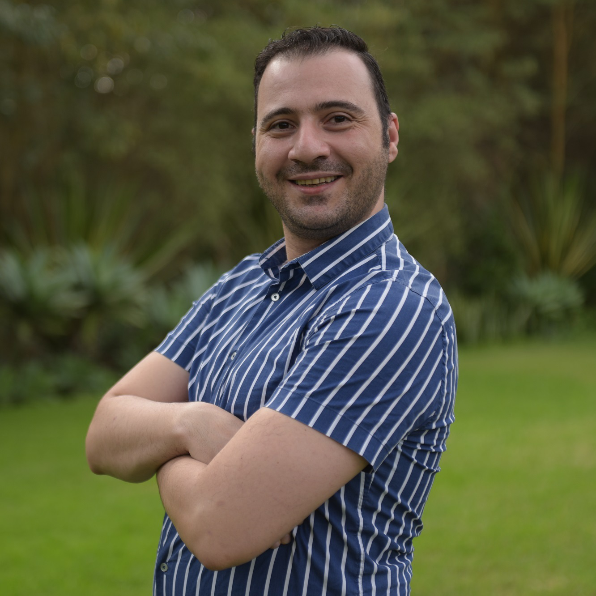

# <i class='fa fa-map'></i> Introduction

## <i class='fa fa-map'></i>

Image of HOT and ATI logo, about me

## <i class='fa fa-map'></i>
:::: {.columns}

::: {.column width="15%"}

::: 

::: {.column width="30%"}

::: {style="font-size: 50%;"}

Omran (Germany)

**AI Product owner**

:::

:::

::: {.column width="10%"}
:::

::: {.column width="30%"}

::: {style="font-size: 50%;"}

Kshitij (Nepal)

**Backend developer**

:::

:::

::::

## <i class='fa fa-map'></i>{background-image="../images/fair_morewebpage.png" background-size="800px"}
<i class='fa fa-compass'></i> fAIr

    
   

[https://fair-dev.hotosm.org/](https://fair-dev.hotosm.org/)

## <i class="fas fa-map"></i>{background-image="../images/MLmethod3.png" background-size="1300px"}

## <i class="fas fa-map"></i>{background-image="../images/oam_morewebpage.png" background-size="800px"  background-color="black"}
<i class="far fa-images"></i> RGB from OAM
      
   
[Open Aerial Map](https://openaerialmap.org/)

## <i class="fas fa-map"></i>{background-image="../images/labels_fair.png" background-size="1200px"}
<i class="fas fa-home"></i> Labels from OSM
      
   
[Preprocessing through fAIr website](https://fair-dev.hotosm.org/training-datasets)

<!-- # <i class="fas fa-server"></i> ML engine -->

<!-- # <i class="fas fa-graduation-cap"></i> Semantic segmentation -->

## <i class='fa fa-search'></i>{background-image="../images/fair_sample1.png" background-size="1200px"}
<i class="fas fa-lightbulb"></i> Reason for research

## <i class='fa fa-search'></i>{background-image="../images/fair_sample1_pred.png" background-size="1200px"}
<i class="fas fa-lightbulb"></i> 

## <i class='fa fa-search'></i>{background-image="../images/fair_sample2.png" background-size="1200px" background-color="black"}
<i class="fas fa-lightbulb"></i> 

## <i class='fa fa-search'></i>{background-image="../images/fair_sample2_pred.png" background-size="1200px" background-color="black"}
<i class="fas fa-lightbulb"></i> 

## <i class='fa fa-search'></i>{background-image="../images/fair_sample2_pred.png" background-size="1200px" background-color="black"}
<i class="fas fa-lightbulb"></i> 
   

How accurate is fAIr in detecting buildings

in different conditions?

## <i class="fas fa-search"></i>{background-image="../images/metrics2.png" background-size="1200px"}
<i class="fas fa-chart-line"></i> Metrics
      
    

Source: [https://metrics-reloaded.dkfz.de/metric-library](Metric reloaded, Reinke et al.)

## <i class="fas fa-search"></i>{background-image="../images/metrics3.png" background-size="1200px"}
<i class="fas fa-chart-line"></i> Metrics
      
    

Source: [https://metrics-reloaded.dkfz.de/metric-library](Metric reloaded, Reinke et al.)

# <i class="fas fa-globe-africa"></i> Dataset

## <i class="fas fa-globe-africa"></i>

|    |        |
|--------|--------|
| **Urban regions**  | 25   |
| **Countries**  | 21   |
| **Zoom levels**    |  19, 20, 21 | 
| **N. images**   | 8400   (~350 per region)  |
| **Images size** | 256x256 |
| **Resolution**  | cm |
|    |        |

<!-- :  {tbl-colwidths="[70,30]"} -->
## <i class="fas fa-globe-africa"></i>{background-image="../images/world_map_citieslocations.png"}
<i class="fas fa-map-marker-alt"></i> Locations

## <i class="fas fa-globe-africa"></i>{background-image="../images/world_map_byurbantype.png"}
<i class="fas fa-list"></i> Degree of urbanity

## <i class="fas fa-globe-africa"></i>{background-image="../images/urban1.png" background-color="black"}
<i class='fa fa-university'></i> Rural

 
Desa Kulaba

[Indonesia]

## <i class="fas fa-globe-africa"></i>{background-image="../images/urban2.png"}
<i class='fa fa-university'></i> Peri-urban

 
Ggaba

[Uganda]

## <i class="fas fa-globe-africa"></i>{background-image="../images/urban4.png" background-color="black"}
<i class='fa fa-university'></i> Urban

 
Bogota

[Colombia]

## <i class="fas fa-globe-africa"></i>{background-image="../images/urban3.png" background-color="black"}
<i class='fa fa-university'></i> Refugee camp

 
Kakuma

[Kenya]

## <i class="fas fa-globe-africa"></i>{background-image="../images/world_map_bycovertype.png"}
<i class="fas fa-list"></i> Roof cover type

## <i class="fas fa-globe-africa"></i>{background-image="../images/cover1.png"}
<i class='fas fa-shapes'></i>  Shingles

 
Silvania

[Brasil]

## <i class="fas fa-globe-africa"></i>{background-image="../images/cover2.png" background-color="black"}
<i class='fas fa-shapes'></i> Metal

 
Ngaoundere

[Cameroon]

## <i class="fas fa-globe-africa"></i>{background-image="../images/cover3.png"}
<i class='fas fa-shapes'></i> Cement

 
Melbourne

[Australia]

## <i class="fas fa-globe-africa"></i>{background-image="../images/cover4.png"}
<i class='fas fa-shapes'></i> Mixed

 
Kutupalong

[Bangladesh]

## <i class="fas fa-globe-africa"></i>{background-image="../images/world_map_bydensity.png"}
<i class="fas fa-list"></i> Urban density

## <i class="fas fa-globe-africa"></i>{background-image="../images/density1.png" background-color="black"}
<i class='fa fa-th'></i> Dense

 
Montevideo

[Uruguay]

## <i class="fas fa-globe-africa"></i>{background-image="../images/density3.png"}
<i class='fa fa-th'></i> Sparse

 
Gornja Rijeka

[Croatia]

## <i class="fas fa-globe-africa"></i>{background-image="../images/density2.png"}
<i class='fa fa-th'></i> Grid

 
Quincy

[USA]

# <i class='fa fa-chart-bar'></i> Results

<!-- ## <i class="fas fa-chart-bar"></i>
<i class="fas fa-hourglass-half"></i> Training

|    |        |
|--------|--------|
| **Urban regions**  | all (25) |
| **N. of epochs**  | 20   |
| **Batch sizes**    |      4   (2, 4, 8, 16) | 
| **Accuracy metrics**   | 5  Categorical accuracy, Precision, Recall, F1 Score, IoU  |
|    |        | -->

## <i class='fa fa-chart-bar'></i>Results{background-image="../images/plot_map_density2.png" background-size="800px"}
~~<i class='fa fa-university'></i> Urbanity~~

~~<i class='fas fa-shapes'></i> Roof type~~

<i class='fa fa-th'></i> Density

## <i class='fa fa-chart-bar'></i>Results{background-image="../images/plot_map_density2.png" background-size="800px"}

    
SAME IMAGE WITH NUMBERS ON TOP

## <i class="fas fa-hand-point-down"></i>{background-image="../images/Banyuwangi1.png" background-size="1100px"}
<i class="fas fa-map-marked-alt"></i>

 
Banyuwangi

[Indonesia]

## <i class="fas fa-hand-point-down"></i>{background-image="../images/Banyuwangi1_pred.png" background-size="1100px"}
<i class="fas fa-map-marked-alt"></i>

 
Banyuwangi

[Indonesia]

## <i class="fas fa-hand-point-down"></i>{background-image="../images/Banyuwangi2.png" background-size="1100px"}
<i class="fas fa-map-marked-alt"></i>

 
Banyuwangi

[Indonesia]

## <i class="fas fa-hand-point-down"></i>{background-image="../images/Banyuwangi2_pred.png" background-size="1100px"}
<i class="fas fa-map-marked-alt"></i>

 
Banyuwangi

[Indonesia]

## <i class="fas fa-hand-point-down"></i>{background-image="../images/Pallabi1.png" background-size="1100px"}
<i class="fas fa-map-marked-alt"></i>

 
Pallaby, Dhaka

[Bangladesh]

## <i class="fas fa-hand-point-down"></i>{background-image="../images/Pallabi1_pred.png" background-size="1100px"}
<i class="fas fa-map-marked-alt"></i>

 
Pallaby, Dhaka

[Bangladesh]

## <i class="fas fa-hand-point-down"></i>{background-image="../images/Pallabi2.png" background-size="1100px"}
<i class="fas fa-map-marked-alt"></i>

 
Pallaby, Dhaka

[Bangladesh]

## <i class="fas fa-hand-point-down"></i>{background-image="../images/Pallabi2_pred.png" background-size="1100px"}
<i class="fas fa-map-marked-alt"></i>

 
Pallaby, Dhaka

[Bangladesh]

# <i class="fas fa-praying-hands"></i> THANK YOU {background-image="../images/black_background.jpg" background-color="black"}

    
<i class='fa fa-at'></i>
 
Code [https://github.com/ciupava/fAIr-utilities](https://github.com/ciupava/fAIr-utilities)
 
fAIr website [https://fair.hotosm.org/](https://fair.hotosm.org/)
 
Link to this presentation <i class="fas fa-angle-down"></i>