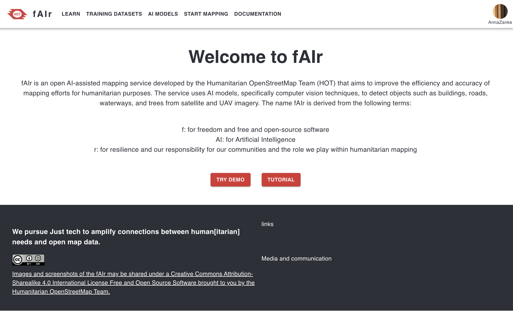
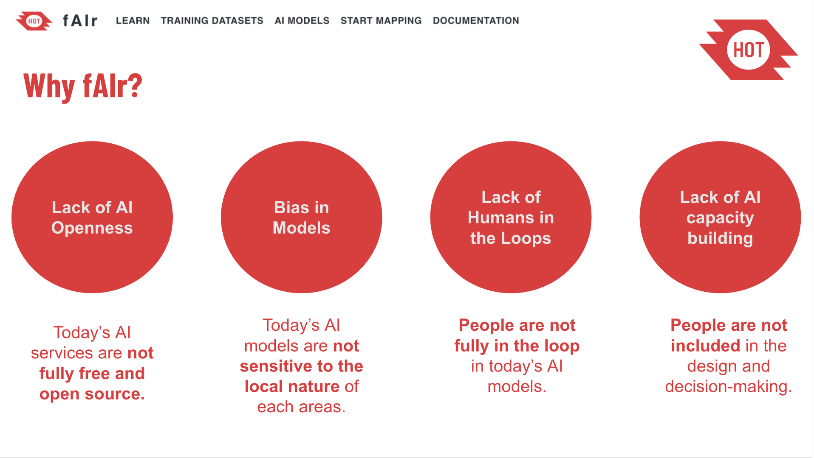

# <i class='fa fa-align-left'></i> Summary

## <i class='fa fa-align-left'></i> {.smaller}

:::: {.columns}

::: {.column width="30%"}

* <i class='fa fa-map'></i> Introduction
    * <i class="fas fa-pepper-hot"></i> HOT OSM
        -   <i class='fa fa-compass'></i> fAIr
        -   <i class="fas fa-server"></i> ML model
        -   <i class="fas fa-lightbulb"></i> reason for research
:::

::: {.column width="4%"}
:::

::: {.column width="30%"}
* <i class="fas fa-search"></i> Research
    <!-- *  <i class="fas fa-crosshairs"></i> Aim -->
    * <i class="fas fa-wrench"></i> Methods
        * <i class="fas fa-table"></i> Data
          - <i class="far fa-images"></i> Chips, OAM
          - <i class="fas fa-home"></i> Masks
        - <i class="fas fa-globe-africa"></i> Dataset
          - <i class="fas fa-map-marker-alt"></i> Locations
          - <i class="fas fa-list"></i> Categories

:::

::: {.column width="3%"}
:::

::: {.column width="30%"}

* <i class='fa fa-puzzle-piece'></i> Results
    * <i class='fa fa-chart-bar'></i> Graphs
    * <i class="fas fa-list-ol"></i> Numbers

:::

::::

<!-- ## <i class='fa fa-align-left'></i>

::: {layout-ncol=2}

::: -->

## Awesome icons
<i class="fas fa-globe"></i>
<i class="fas fa-globe-americas"></i>
<i class="fas fa-globe-africa"></i>
<i class="fab fa-diaspora"></i>
<i class='fa fa-braille'></i>
<i class="fas fa-dice-three"></i>
<i class="fas fa-disease"></i>
<i class="fa-regular fa-square"></i>
<i class="fa-duotone fa-grid"></i>
<i class="fas fa-grip-horizontal"></i>
<i class="fas fa-border-none"></i>
<i class="fa-solid fa-grid"></i>
<i class="fa-solid fa-grid"></i>
<i class='fa fa-square-o'></i>
<i class='fa fa-th-list'></i>
<i class='fa fa-th'></i>
<i class='fa fa-th-large'></i>
<i class='fa fa-tasks'></i>
<i class='fa fa-window-restore'></i>
<i class='fa fa-window-maximize'></i>
<i class='fa fa-minus'></i>
<i class='fa fa-circle-thin'></i>
<i class='fa fa-navicon'></i>
<i class='fa fa-reorder'></i>

<i class="fas fa-shapes"></i>
<i class="fas fa-border-all"></i>
<i class='fa fa-th'></i>
<i class='fa fa-th-large'></i>

<i class='fa fa-stop'></i>
<i class='fa fa-home'></i>
<i class='fa fa-building'></i>
<i class="far fa-building"></i>
<i class="fas fa-hotel"></i>
<i class='fa fa-industry'></i>
<i class="fas fa-landmark"></i>
<i class="fas fa-landmark"></i>
<i class="fas fa-store-alt"></i>
<i class='fa fa-compass'></i>
<i class='fa fa-signal'></i>
<i class='fa fa-tag'></i>
<i class='fa fa-tags'></i>
<i class='fa fa-university'></i>
<i class='fa fa-tree'></i>
<i class='fa fa-wrench'></i>
<i class='fa fa-paperclip'></i>
<i class='fa fa-scissors'></i>
<i class='fa fa-file'></i>
<i class='fa fa-file-o'></i>
<i class='fa fa-comment'></i>
<i class='fa fa-comments'></i>
<i class="far fa-comment"></i>
<i class='fa fa-search'></i>
<i class='fa fa-send'></i>
<i class='fa fa-photo'></i>
<i class="fas fa-umbrella-beach"></i>

<i class="fas fa-chart-bar"></i>
<i class="fas fa-terminal"></i>
<i class="fas fa-tools"></i>

<i class="fas fa-pepper-hot"></i>
<i class="fab fa-hotjar"></i>
<i class="fas fa-fire-alt"></i>
<i class="fas fa-fire"></i>
<i class="fas fa-burn"></i>

<i class="fab fa-periscope"></i>
<i class="fas fa-microscope"></i>
<i class="fas fa-search"></i>

<i class='fas fa-shoe-prints'></i> <i class='fa fa-paw'></i>

<i class="fas fa-award"></i> <i class="fas fa-list-ol"></i>

<i class="fas fa-map-marked-alt"></i> <i class="fas fa-image"></i>

<i class='fa fa-'></i>

# <i class='fa fa-map'></i> Introduction

## <i class='fa fa-map'></i> 
<i class="fab fa-hotjar"></i> **HOT**

:::: {.columns}

::: {.column width="45%"}

:::

::: {.column width="10%"}
:::

::: {.column width="45%"}

:::

::::

<!-- 
{.absolute top="70" left="30"}
  
{.absolute top="330" left="30"} -->

## <i class='fa fa-map'></i>{background-image="../images/fair_webpage.png" background-size="1200px"}
<i class='fa fa-compass'></i> fAIr
<!--  -->

    
   

[https://fair-dev.hotosm.org/](https://fair-dev.hotosm.org/)

## <i class='fa fa-map'></i> {background-image="../images/fair_why.png" background-size="1200px"}
<i class='fa fa-compass'></i> fAIr
<!--  -->
      
    

[https://fair-dev.hotosm.org/](https://fair-dev.hotosm.org/)

## <i class='fa fa-map'></i>{background-image="../images/ramp.png" background-size="1300px" background-color="black"}
<i class="fas fa-server"></i> ML engine

      
   

[https://rampml.global/](https://rampml.global/)

## <i class='fa fa-map'></i>{background-image="../images/ramp_effunet.png" background-size="1000px"}
<i class="fas fa-server"></i> ML engine

      
   

[2020 paper by Baheti et al.](https://rampml.global/ramp-model-card/)

## <i class='fa fa-map'></i>{background-image="../images/fair_sample1.png" background-size="1200px"}
<i class="fas fa-lightbulb"></i> Reason for research

## <i class='fa fa-map'></i>{background-image="../images/fair_sample1_pred.png" background-size="1200px"}
<i class="fas fa-lightbulb"></i> 

## <i class='fa fa-map'></i>{background-image="../images/fair_sample2.png" background-size="1200px" background-color="black"}
<i class="fas fa-lightbulb"></i> 

## <i class='fa fa-map'></i>{background-image="../images/fair_sample2_pred.png" background-size="1200px" background-color="black"}
<i class="fas fa-lightbulb"></i> 

## <i class='fa fa-map'></i>{background-image="../images/fair_sample2_pred.png" background-size="1200px" background-color="black"}
<i class="fas fa-lightbulb"></i> 
   

*How accurate is fAIr in detecting buildings*

*in different conditions?"*

# <i class="fas fa-search"></i>Research

<!-- ## <i class="fas fa-search"></i>
<i class="fas fa-crosshairs"></i> **Research question**
   

*How accurate is fAIr in detecting buildings*

*in different conditions?"* -->

## <i class="fas fa-search"></i>
<i class="fas fa-table"></i> Data

<!-- ::: {layout-ncol=2}

<i class="far fa-images"></i> RGB from OAM
  
[Open Aerial Map](https://openaerialmap.org/)

<i class="fas fa-home"></i> Masks
  
[OSM labels through fAIr website](https://fair-dev.hotosm.org/training-datasets)

::: -->

## <i class="fas fa-table"></i>{background-image="../images/oam3.png" background-size="1100px"}
<i class="far fa-images"></i> [RGB from OAM]{style="color:white;"}
      
   
[Open Aerial Map](https://openaerialmap.org/)

## <i class="fas fa-table"></i>{background-image="../images/labels_fair.png" background-size="1200px"}
<i class="fas fa-home"></i> Labels from OSM
      
   
[Preprocessing through fAIr website](https://fair-dev.hotosm.org/training-datasets)

## <i class="fas fa-search"></i>
<i class="fas fa-globe-africa"></i> Dataset

|    |        |
|--------|--------|
| **Urban regions**  | 25   |
| **Countries**  | 21   |
| **Zoom levels**    |      3   (19, 20, 21) | 
| **N. images**   | 8400   (~350 per region)  |
| **Resolution**  | cm |
|    |        |

<!-- :  {tbl-colwidths="[70,30]"} -->

## <i class="fas fa-search"></i>{background-image="../images/world_map_citieslocations.png"}
<i class="fas fa-map-marker-alt"></i> Locations

## <i class="fas fa-search"></i>{background-image="../images/world_map_bydensity.png"}
<i class="fas fa-list"></i> Categories

## <i class="fas fa-search"></i>{background-image="../images/world_map_bycovertype.png"}
<i class="fas fa-list"></i> Categories

## <i class="fas fa-search"></i>{background-image="../images/world_map_byurbantype.png"}
<i class="fas fa-list"></i> Categories

## <i class="fas fa-search"></i>{background-image="../images/density1.png" background-color="black"}
<i class='fa fa-th'></i> Dense

Montevideo dense

## <i class="fas fa-search"></i>{background-image="../images/density3.png"}
<i class='fa fa-th'></i> Sparse

Gornja Rijeka

## <i class="fas fa-search"></i>{background-image="../images/density2.png"}
<i class='fa fa-th'></i> Grid

Quincy

## <i class="fas fa-search"></i>{background-image="../images/cover1.png"}
<i class='fas fa-shapes'></i>  Shingles

Silvania

## <i class="fas fa-search"></i>{background-image="../images/cover2.png" background-color="black"}
<i class='fas fa-shapes'></i> Metal

Ngandoure

## <i class="fas fa-search"></i>{background-image="../images/cover3.png"}
<i class='fas fa-shapes'></i> Cement

Melbourne

## <i class="fas fa-search"></i>{background-image="../images/cover4.png"}
<i class='fas fa-shapes'></i> Mixed

Kutu Palong

## <i class="fas fa-search"></i>{background-image="../images/urban1.png" background-color="black"}
<i class='fa fa-university'></i> Rural

Desa Kulaba

## <i class="fas fa-search"></i>{background-image="../images/urban2.png"}
<i class='fa fa-university'></i> Peri-urban

Ggaba

## <i class="fas fa-search"></i>{background-image="../images/urban4.png" background-color="black"}
<i class='fa fa-university'></i> Urban

Bogota

## <i class="fas fa-search"></i>{background-image="../images/urban3.png" background-color="black"}
<i class='fa fa-university'></i> Refugee camp

Kakuma

## <i class="fas fa-search"></i>
<i class="fas fa-hourglass-half"></i> Training

|    |        |
|--------|--------|
| **Urban regions**  | all (25) |
| **N. of epochs**  | 20   |
| **Batch sizes**    |      4   (2, 4, 8, 16) | 
| **Accuracy metrics**   | 5  Categorical accuracy, Precision, Recall, F1 Score, IoU  |
|    |        |

# <i class='fa fa-chart-bar'></i> Results

## <i class='fa fa-chart-bar'></i>{background-image="../images/graph_sample.png" background-size="900px"}

## <i class='fa fa-chart-bar'></i>{background-image="../images/graph_with_circle.png" background-size="900px"}

## <i class='fa fa-chart-bar'></i>{background-image="../images/plot_map_roof.png" background-size="800px"}
<i class='fas fa-shapes'></i> Roof type

## <i class='fa fa-chart-bar'></i>{background-image="../images/plot_map_urban.png" background-size="800px"}
<i class='fa fa-university'></i> Urbanity

## <i class='fa fa-chart-bar'></i>{background-image="../images/plot_map_density.png" background-size="800px"}
<i class='fa fa-th'></i> Density

## <i class='fa fa-chart-bar'></i>{background-image="../images/plot_box_density.png" background-size="800px"}
<i class='fa fa-puzzle-piece'></i>

## <i class='fa fa-chart-bar'></i>{background-image="../images/plot_box_metrics.png" background-size="800px"}
<i class='fa fa-puzzle-piece'></i>

## <i class='fa fa-chart-bar'></i>{background-image="../images/plot_box_comparebatches.png" background-size="800px"}
<i class='fa fa-puzzle-piece'></i>

# <i class="fas fa-map-marked-alt"> </i> Showcase

2-3 extreme cases to show

# <i class="fas fa-hand-point-down"></i> Conclusions

## <i class="fas fa-hand-point-down"></i>{background-image="../images/plot_box_totdensity.png" background-size="800px"}

## <i class="fas fa-hand-point-down"></i>{background-image="../images/plot_box_totmetrics.png" background-size="800px"}

## <i class="fas fa-hand-point-down"></i>
Some nice numbers

<i class='fa fa-at'></i> Links
  

GitHub fork of `fair-utilities` [link](https://github.com/ciupava/fAIr-utilities)
 
fAIr website [link](https://fair-dev.hotosm.org/)
 
This presentation [link](https://ciupava.github.io/talks/team_call_Dec2023_fAIr/slides.html)

# [THANK YOU]{style="color:white;"} {background-image="../images/black_background.jpg"}
