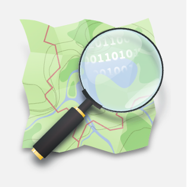
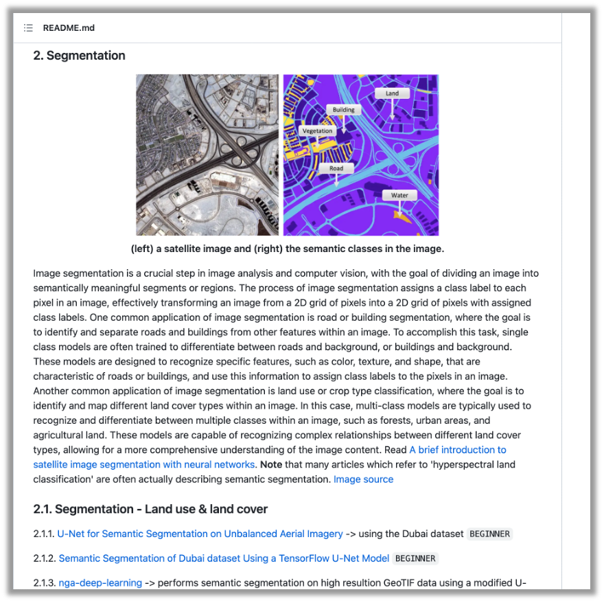
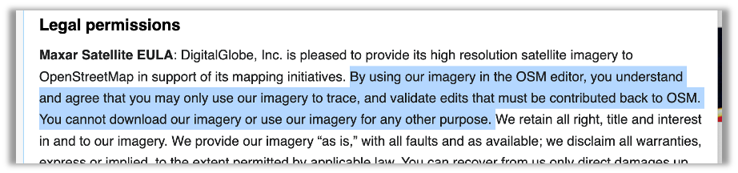
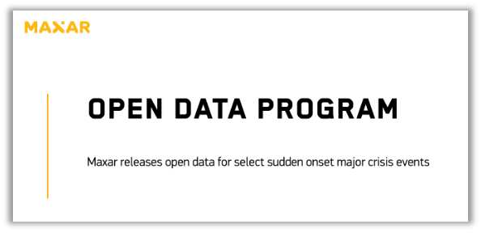

# <i class='fa fa-align-left'></i> Summary

## <i class='fa fa-align-left'></i>
 
 

<i class='fa fa-fire'></i> Presenting HOT and fAIr 

<i class='fa fa-eye'></i> Demo

<i class='fa fa-laptop'></i> On computer Vision

<i class='fa fa-map-marker'></i> </i> Current status of the project

<!-- ## Summary

 
 

::: {.fragment .fade-in-then-semi-out}
<i class='fa fa-fire'></i> Presenting HOT and fAIr 
:::
::: {.fragment .fade-in-then-semi-out}
<i class='fa fa-eye'></i> Demo
:::
::: {.fragment .fade-in-then-semi-out}
<i class='fa fa-laptop'></i> Intro on computer Vision  <i class='fa fa-arrow-right'></i> Image segmentation
:::
::: {.fragment .fade-in-then-semi-out}
<i class='fa fa-rocket'></i> Current status of the project
::: -->

# <i class='fa fa-map'></i> Background
<!-- ## <i class='fa fa-map'></i> Background {background-image="../images/me_background4.png"} -->
## <i class='fa fa-map'></i> {background-image="../images/world_map_citieslocations.png"}
<!-- ### Turing Research Fellowship
(since April 2023) -->

# <i class='fa fa-fire'></i> HOT and fAIr
## <i class='fa fa-fire'></i>

{.absolute top="70" left="30"}

{.absolute top="330" left="30"}
<!--             -->
      
&nbsp;&nbsp;&nbsp;&nbsp;&nbsp;&nbsp;&nbsp;
&nbsp;&nbsp;&nbsp;&nbsp;&nbsp;&nbsp;&nbsp;
&nbsp;&nbsp;&nbsp;&nbsp;&nbsp;&nbsp;&nbsp;
&nbsp;&nbsp;&nbsp;&nbsp;&nbsp;&nbsp;&nbsp;
&nbsp;&nbsp;&nbsp;&nbsp;&nbsp;&nbsp;&nbsp;
&nbsp;&nbsp;&nbsp;&nbsp;&nbsp;&nbsp;&nbsp;
[https://fair-dev.hotosm.org/](https://fair-dev.hotosm.org/)

## <i class='fa fa-fire'></i> {background-image="../images/world_map_bydensity.png"}
<!-- ## Introduction to HOT and fAIr {background-image="../images/fair_slide.png"} -->

## <i class='fa fa-fire'></i> {background-image="../images/world_map_bycovertype.png"}
<!-- ## Introduction to HOT and fAIr {background-image="../images/fair_why.png"} -->

# <i class='fa fa-eye'></i> Demo
## <i class='fa fa-eye'></i> {background-image="../images/fair_webpage.png"}
      
[https://fair-dev.hotosm.org/](https://fair-dev.hotosm.org/)

##
<!-- ## <i class='fa fa-eye'></i> -->
<video controls="controls" autopla id="my_video" class="video-js vjs-default-skin" width="1600" height="1200" src="file:////Users/azanchetta/Library/CloudStorage/OneDrive-TheAlanTuringInstitute/Desktop/video_fAIr.mov" type='video/mov' />
</video>

# <i class='fa fa-rocket'></i> Let's make it work better!
<!-- ## <i class='fa fa-rocket'></i> Let's make it work better! -->

## <i class='fa fa-rocket'></i> {background-image="../images/fully_CNN.png"}
<!-- ## Let's make it work better! -->

<!-- <i class='fa fa-laptop'></i> (short) Intro to Computer Vision -->
<i class='fa fa-laptop'></i> **Computer Vision**
<!-- *cnn graph image* -->

::: footer
Source: [Towardsdatascience](https://towardsdatascience.com/semantic-segmentation-popular-architectures-dff0a75f39d0)
:::

## <i class='fa fa-rocket'></i> {background-image="../images/image_segm.png"}
<!-- ## Let's make it work better! -->
<!-- <i class='fa fa-laptop'></i> (short) Intro to Computer Vision -->
<i class='fa fa-laptop'></i>
<!-- Image segmentation -->

::: footer
Source: [Hoeser et al. 2020](https://www.mdpi.com/2072-4292/12/10/1667)
:::

## <i class='fa fa-rocket'></i> {background-image="../images/buildfoot_image.png"}
<!-- ## Let's make it work better! -->

<!-- <i class='fa fa-laptop'></i> (short) Intro to Computer Vision -->
<i class='fa fa-laptop'></i>
<!-- *... for buildings footprints image* -->

<!-- ## <i class='fa fa-rocket'></i>
## Let's make it work better! -->

::: footer
Source: [GitHub](https://github.com/bohaohuang/mrs/tree/master)
:::

## <i class='fa fa-puzzle-piece'></i> Challenges
<!-- ## <i class='fa fa-rocket'></i>

<i class='fa fa-puzzle-piece'></i> **Challenges** -->
 
<!-- ## <i class='fa fa-rocket'></i>  -->
<!-- ## Let's make it work better! {background-image="../images/models_list.png"} -->
 
Models availability
{.absolute top="10" left="340"}
   
[https://github.com/satellite-image-deep-learning/techniques](https://github.com/satellite-image-deep-learning/techniques)

<!-- ## <i class='fa fa-rocket'></i>

<i class='fa fa-puzzle-piece'></i> **Challenges**
 
<!-- ## <i class='fa fa-rocket'></i>
 
Data availability
 
{.absolute top="190" left="150"}
[Maxar](https://wiki.openstreetmap.org/wiki/Maxar)
    
{.absolute top="370" left="380"}
[open data program](https://www.maxar.com/open-data) -->

## <i class='fa fa-puzzle-piece'></i>
<!-- ## <i class='fa fa-rocket'></i> -->
 
Data availability
 
{.absolute top="190" left="150"}
[Maxar](https://wiki.openstreetmap.org/wiki/Maxar)
    
{.absolute top="370" left="380"}
[open data program](https://www.maxar.com/open-data)

## <i class='fa fa-puzzle-piece'></i>
<!-- ## <i class='fa fa-rocket'></i> -->
{.absolute top="70" left="320"}
 
Data availability
  
[Open Aerial Map](https://openaerialmap.org/)

# <i class='fa fa-map-marker'></i> </i> Current status of the project
<!-- ## <i class='fa fa-map-marker'></i> </i> Current status of the project -->

## <i class='fa fa-map-marker'></i> </i>
 

::: {.fragment .fade-in-then-semi-out}
- <i class='fa fa-thermometer-half'></i> Assess the current performance <i class='fa fa-arrow-right'></i> metric 
:::
::: {.fragment .fade-in-then-semi-out}
- <i class='fa fa-github'></i>  <i class='fa fa-code'></i>  <i class='fa fa-code-fork'></i>Code in GitHub
:::
::: {.fragment .fade-in-then-semi-out}
- <i class='fa fa-cloud'></i> Cloud computation  <i class='fa fa-arrow-right'></i> Azure
:::

## <i class='fa fa-map-marker'></i> </i> {background-image="../images/prediction_2ep.png"}

 
  
  
&nbsp;&nbsp;&nbsp;&nbsp;&nbsp;&nbsp;&nbsp;
&nbsp;&nbsp;&nbsp;&nbsp;&nbsp;&nbsp;&nbsp;
&nbsp;&nbsp;&nbsp;&nbsp;&nbsp;&nbsp;&nbsp;
&nbsp;&nbsp;&nbsp;&nbsp;&nbsp;&nbsp;&nbsp;
&nbsp;&nbsp;&nbsp;&nbsp;&nbsp;&nbsp;&nbsp;
&nbsp;&nbsp;&nbsp;&nbsp;&nbsp;&nbsp;&nbsp;
&nbsp;&nbsp;&nbsp;&nbsp;&nbsp;&nbsp;&nbsp;
&nbsp;&nbsp;&nbsp;&nbsp;&nbsp;&nbsp;&nbsp;
&nbsp;&nbsp;&nbsp;&nbsp;&nbsp;&nbsp;&nbsp;
&nbsp;&nbsp;&nbsp;&nbsp;&nbsp;&nbsp;&nbsp;
&nbsp;&nbsp;&nbsp;&nbsp;&nbsp;&nbsp;&nbsp;
&nbsp;&nbsp;&nbsp;&nbsp;&nbsp;&nbsp;&nbsp;&nbsp;&nbsp;
&nbsp;&nbsp;&nbsp;&nbsp;&nbsp;&nbsp;&nbsp;<i class='fa fa-thermometer-half'></i>  2 epochs

## <i class='fa fa-map-marker'></i> </i> {background-image="../images/prediction_3ep.png"}
 
  
  
&nbsp;&nbsp;&nbsp;&nbsp;&nbsp;&nbsp;&nbsp;
&nbsp;&nbsp;&nbsp;&nbsp;&nbsp;&nbsp;&nbsp;
&nbsp;&nbsp;&nbsp;&nbsp;&nbsp;&nbsp;&nbsp;
&nbsp;&nbsp;&nbsp;&nbsp;&nbsp;&nbsp;&nbsp;
&nbsp;&nbsp;&nbsp;&nbsp;&nbsp;&nbsp;&nbsp;
&nbsp;&nbsp;&nbsp;&nbsp;&nbsp;&nbsp;&nbsp;
&nbsp;&nbsp;&nbsp;&nbsp;&nbsp;&nbsp;&nbsp;
&nbsp;&nbsp;&nbsp;&nbsp;&nbsp;&nbsp;&nbsp;
&nbsp;&nbsp;&nbsp;&nbsp;&nbsp;&nbsp;&nbsp;
&nbsp;&nbsp;&nbsp;&nbsp;&nbsp;&nbsp;&nbsp;
&nbsp;&nbsp;&nbsp;&nbsp;&nbsp;&nbsp;&nbsp;
&nbsp;&nbsp;&nbsp;&nbsp;&nbsp;&nbsp;&nbsp;&nbsp;&nbsp;
&nbsp;&nbsp;&nbsp;&nbsp;&nbsp;&nbsp;&nbsp;<i class='fa fa-thermometer-half'></i> 3 epochs

## <i class='fa fa-map-marker'></i> </i> {background-image="../images/prediction_4ep.png"}
 
  
  
&nbsp;&nbsp;&nbsp;&nbsp;&nbsp;&nbsp;&nbsp;
&nbsp;&nbsp;&nbsp;&nbsp;&nbsp;&nbsp;&nbsp;
&nbsp;&nbsp;&nbsp;&nbsp;&nbsp;&nbsp;&nbsp;
&nbsp;&nbsp;&nbsp;&nbsp;&nbsp;&nbsp;&nbsp;
&nbsp;&nbsp;&nbsp;&nbsp;&nbsp;&nbsp;&nbsp;
&nbsp;&nbsp;&nbsp;&nbsp;&nbsp;&nbsp;&nbsp;
&nbsp;&nbsp;&nbsp;&nbsp;&nbsp;&nbsp;&nbsp;
&nbsp;&nbsp;&nbsp;&nbsp;&nbsp;&nbsp;&nbsp;
&nbsp;&nbsp;&nbsp;&nbsp;&nbsp;&nbsp;&nbsp;
&nbsp;&nbsp;&nbsp;&nbsp;&nbsp;&nbsp;&nbsp;
&nbsp;&nbsp;&nbsp;&nbsp;&nbsp;&nbsp;&nbsp;
&nbsp;&nbsp;&nbsp;&nbsp;&nbsp;&nbsp;&nbsp;&nbsp;&nbsp;
&nbsp;&nbsp;&nbsp;&nbsp;&nbsp;&nbsp;&nbsp;<i class='fa fa-thermometer-half'></i> 4 epochs

## <i class='fa fa-map-marker'></i> </i> 
<!-- ## <i class='fa fa-id-card'></i> A name?  -->
 
<i class='fa fa-id-card'></i> A name? 
  

 -  Groundwork
  

 -  Footing
  
 
 -  Grounds
  
 
 -  Buifoot

## <i class='fa fa-map-marker'></i> </i>
<!-- ## <i class='fa fa-at'></i> Links -->
 
<i class='fa fa-at'></i> Links
  

GitHub fork from HOT's `fair-utilities` [link](https://github.com/ciupava/fAIr-utilities)
 
HackMD notes [link](https://hackmd.io/@annazan/H1PkFnRz6)
 
This presentation [link](https://ciupava.github.io/talks/team_call_Dec2023_fAIr/slides.html)

# THANK YOU
<!-- 
:::{.r-stack}
**THANK YOU**
::: -->