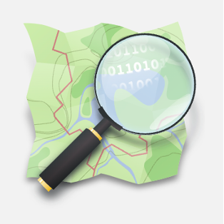

# <i class='fa fa-map'></i> Background
<!-- ## <i class='fa fa-map'></i> Background {background-image="../images/me_background4.png"} -->
## <i class='fa fa-map'></i> {background-image="../images/me_background4.png"}
<!-- ### Turing Research Fellowship
(since April 2023) -->
 <i class='fa fa-signs'></i>

<!-- ## Summary

 
 

::: {.fragment .fade-in-then-semi-out}
<i class='fa fa-fire'></i> Presenting HOT and fAIr 
:::
::: {.fragment .fade-in-then-semi-out}
<i class='fa fa-eye'></i> Demo
:::
::: {.fragment .fade-in-then-semi-out}
<i class='fa fa-laptop'></i> Intro on computer Vision  <i class='fa fa-arrow-right'></i> Image segmentation
:::
::: {.fragment .fade-in-then-semi-out}
<i class='fa fa-rocket'></i> Current status of the project
::: -->

## <i class='fa fa-map'></i> Summary

 
 

<i class='fa fa-fire'></i> Presenting HOT and fAIr 

<i class='fa fa-eye'></i> Demo

<i class='fa fa-laptop'></i> Intro on computer Vision  <i class='fa fa-arrow-right'></i> Image segmentation

<i class='fa fa-map-marker'></i> </i> Current status of the project

# <i class='fa fa-fire'></i> HOT and fAIr
## <i class='fa fa-fire'></i> Introduction to HOT and fAIr

{.absolute top="70" left="30"}

{.absolute top="350" left="30"}

## <i class='fa fa-fire'></i> {background-image="../images/fair_slide.png"}
<!-- ## Introduction to HOT and fAIr {background-image="../images/fair_slide.png"} -->

## <i class='fa fa-fire'></i> {background-image="../images/fair_why.png"}
<!-- ## Introduction to HOT and fAIr {background-image="../images/fair_why.png"} -->

# <i class='fa fa-eye'></i> Demo
## <i class='fa fa-eye'></i> Demo

# <i class='fa fa-rocket'></i> Let's make it work better!
<!-- ## <i class='fa fa-rocket'></i> Let's make it work better! -->

## <i class='fa fa-rocket'></i>
<!-- ## Let's make it work better! -->

<!-- <i class='fa fa-laptop'></i> (short) Intro to Computer Vision -->
<i class='fa fa-laptop'></i>
*cnn graph image*

## <i class='fa fa-rocket'></i>
<!-- ## Let's make it work better! -->

<!-- <i class='fa fa-laptop'></i> (short) Intro to Computer Vision -->
<i class='fa fa-laptop'></i>
*Image Segmentation image*

## <i class='fa fa-rocket'></i>
<!-- ## Let's make it work better! -->

<!-- <i class='fa fa-laptop'></i> (short) Intro to Computer Vision -->
<i class='fa fa-laptop'></i>
*... for buildings footprints image*

<!-- ## <i class='fa fa-rocket'></i>
## Let's make it work better! -->

## <i class='fa fa-puzzle-piece'></i> Challenges
<!-- ## <i class='fa fa-rocket'></i>  -->
<!-- ## Let's make it work better! {background-image="../images/models_list.png"} -->
 
Models availability
{.absolute top="10" left="340"}

## <i class='fa fa-puzzle-piece'></i> Challenges
<!-- ## <i class='fa fa-rocket'></i> -->
 
Data availability
 
{.absolute top="50" left="30"}
[Maxar](https://wiki.openstreetmap.org/wiki/Maxar)
      
{.absolute top="170" left="30"}
[open data program](https://www.maxar.com/open-data)

## <i class='fa fa-puzzle-piece'></i> Challenges
<!-- ## <i class='fa fa-rocket'></i> -->
 
Data availability
 
{.absolute top="340" left="30"}
[Open Aerial Map](https://openaerialmap.org/)

# <i class='fa fa-map-marker'></i> </i> Current status of the project
<!-- ## <i class='fa fa-map-marker'></i> </i> Current status of the project -->

  

::: {.fragment .fade-in-then-semi-out}
- <i class='fa fa-thermometer-half'></i> Assess the current performance <i class='fa fa-arrow-right'></i> metric 
:::
::: {.fragment .fade-in-then-semi-out}
- <i class='fa fa-github'></i>  <i class='fa fa-code'></i>  <i class='fa fa-code-fork'></i>Code in GitHub
:::
::: {.fragment .fade-in-then-semi-out}
- <i class='fa fa-cloud'></i> Cloud computation  <i class='fa fa-arrow-right'></i> Azure
:::

## <i class='fa fa-map-marker'></i> </i> 
<!-- ## <i class='fa fa-id-card'></i> A name?  -->
 
<i class='fa fa-id-card'></i> A name? 
  

 -  Groundwork
  

 -  Footing
  
 
 -  Grounds
  
 
 -  Buifoot

## <i class='fa fa-map-marker'></i> </i>
<!-- ## <i class='fa fa-at'></i> Links -->
 
<i class='fa fa-at'></i> Links
  

GitHub fork from HOT `fair-utilities` [link](https://github.com/ciupava/fAIr-utilities)
 
HackMD notes [link](https://hackmd.io/@annazan/H1PkFnRz6)
 
This presentation [link](https://ciupava.github.io/talks/team_call_Dec2023_fAIr/slides.html)

#

:::{.r-stack}
THANK YOU
:::